# Portl Society

Portl Society is a society management mobile app for Indian residential communities. Residents approve visitors, pay dues, book amenities, and raise complaints. Guards manage gate entry and scan pre-approval QR codes. Admins run the society control center.

Built with **Expo SDK 55**, **React Native**, **Expo Router**, **Supabase**, and payments with **Razorpay**.

## Repository

[nikhild64/expo-portl](https://github.com/nikhild64/expo-portl)

## Demo credentials

After seeding the database (see Setup), sign in with:

| Role | Email | Password |
|------|-------|----------|
| Resident | `resident@portl.demo` | `Portl@123` |
| Guard | `guard@portl.demo` | `Portl@123` |
| Admin | `admin@portl.demo` | `Portl@123` |

## Stack

- **App:** Expo 55, React Native 0.83, Expo Router (file-based routes), Uniwind (Tailwind v4)
- **State & data:** Zustand (auth), TanStack React Query, Supabase JS client
- **Backend:** Supabase Postgres + RLS, Storage, Edge Functions, pg_cron
- **Payments:** Razorpay (test mode)
- **Push:** Expo Notifications + Firebase (via `push-fanout` edge function)

## Prerequisites

- [Bun](https://bun.sh) 1.x
- [Supabase CLI](https://supabase.com/docs/guides/cli)
- Android Studio (emulator) or a physical device
- [EAS CLI](https://docs.expo.dev/build/setup/) for production builds

## Setup

1. **Clone and install**

   ```bash
   bun install
   ```

2. **Environment**

   Copy `.env.example` to `.env` and fill in your Supabase project URL and anon key:

   ```bash
   cp .env.example .env
   ```

   For local Supabase, also add `SUPABASE_SERVICE_ROLE_KEY` (used by `scripts/create-demo-users.mjs`).

3. **Database**

   ```bash
   supabase db reset
   bun scripts/create-demo-users.mjs
   ```

4. **Run the app**

   ```bash
   bun start        # Expo dev server
   bun android      # Run on Android emulator/device
   ```

5. **Tests**

   ```bash
   bun test
   ```

## Project structure

```
src/
  app/              # Expo Router screens (resident, guard, admin, auth)
  components/       # Shared UI primitives
  features/         # Screen logic grouped by domain
  lib/              # Helpers, Supabase client, hooks
  queries/          # React Query hooks
  stores/           # Zustand stores (auth)
supabase/
  migrations/       # Postgres schema + RLS
  functions/        # Edge functions (Razorpay webhook, push fanout)
scripts/            # Demo user seeding, push test utilities
docs/design/        # UI reference screenshots
```

## Architecture

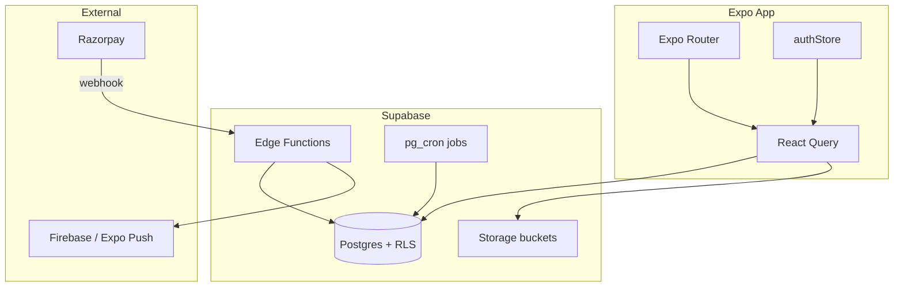

### Key flows

- **Visitor entry:** Guard creates a visitor request → resident gets a push → approves/rejects in-app → guard marks entry at gate.
- **Pre-approval QR:** Resident shares a QR → guard scans → `consume_preapproval` RPC atomically creates the visitor record.
- **Dues:** Admin generates a monthly cycle → residents pay via Razorpay → webhook marks payment captured and updates dues.
- **Amenities:** Resident books a slot → optional Razorpay payment → booking confirmed on capture.

## Demo walkthrough

The recommended demo tells one connected story across all three roles:

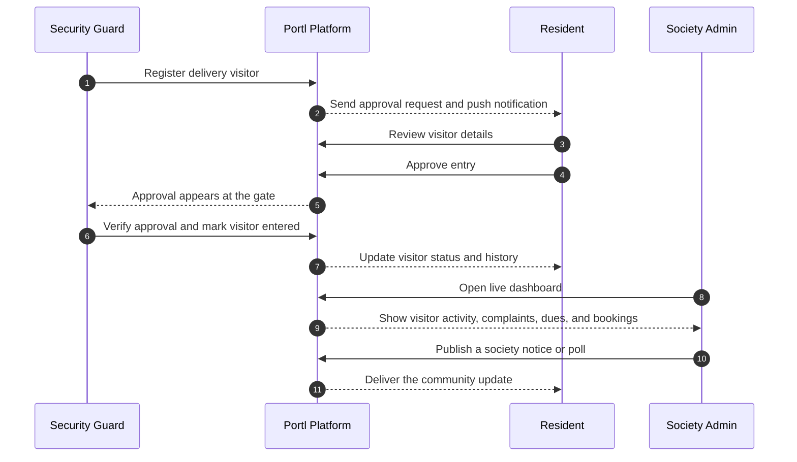

## Install the app

- **Google Play:** [Install Portl Society from Google Play](https://play.google.com/store/apps/details?id=com.nikhild64.portl)
- **APK download:** [Download APK from Google Drive](https://drive.google.com/file/d/1Fz-9mkIw_ZdJBa9BwMcStfLX6rsX8p17/view?usp=sharing)


### Demo video

[Demo video (YouTube)](https://youtu.be/G3EJmfOeZI8)

### Screenshots

| Screen | Screenshot |
|--------|------------|
| Onboarding / sign in | 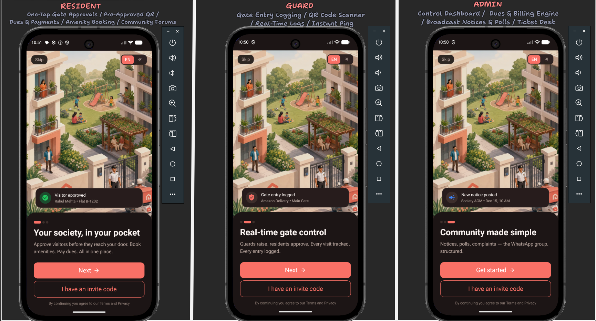 |
| Resident home | 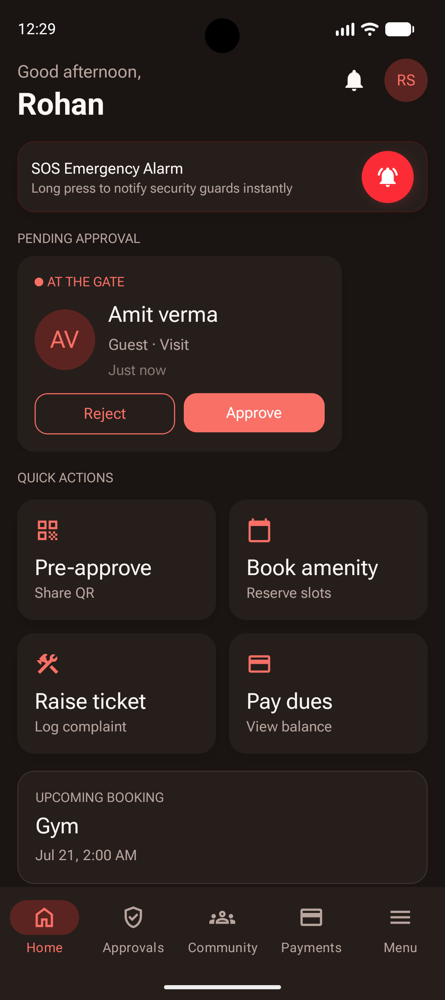 |
| Visitor approval | 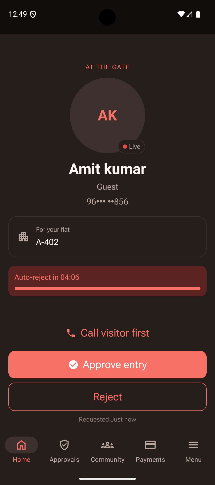 |
| Pre-approval QR | 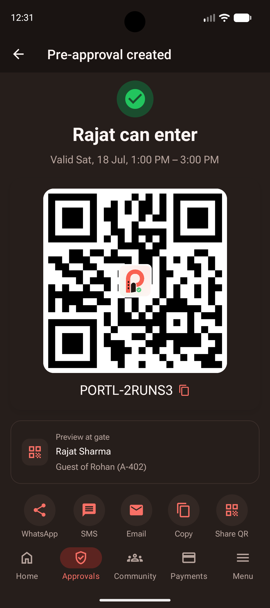 |
| Guard dashboard / entry | 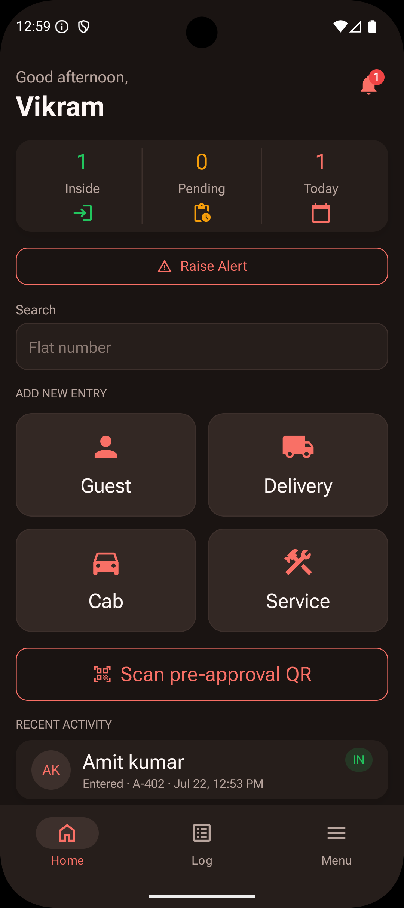 |
| Community notices and polls | 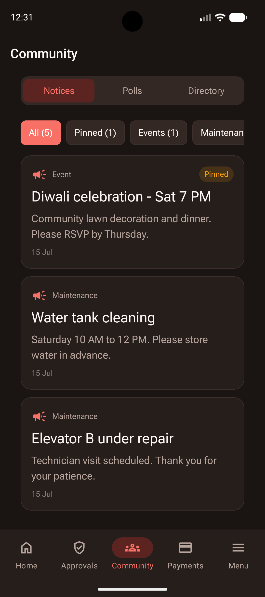 |
| Amenity booking | 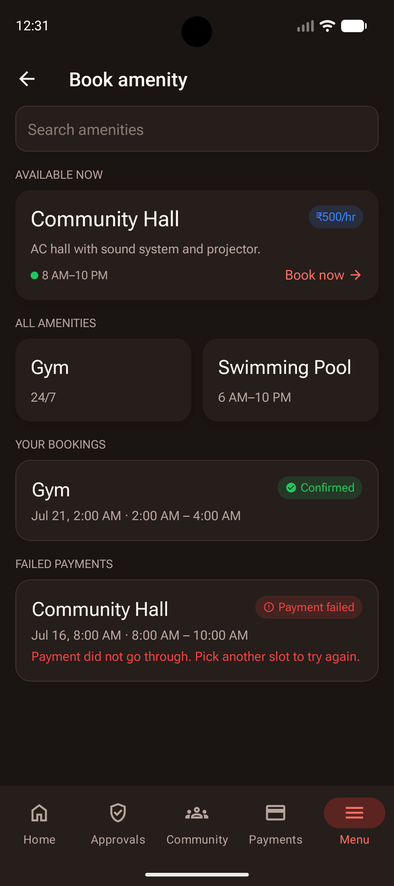 |
| Payments / dues | 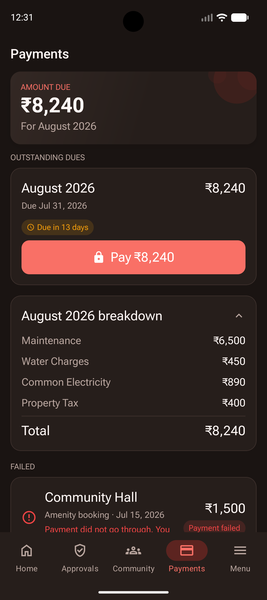 |
| Admin dashboard | 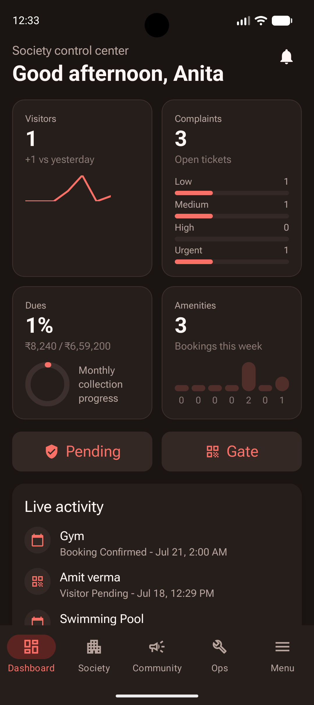 |
| Admin manage issues | 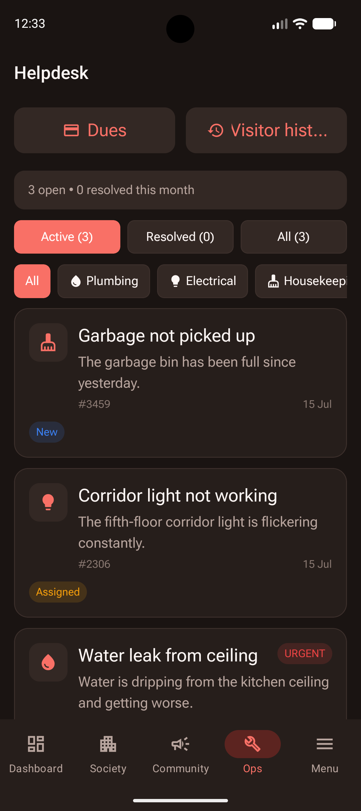 |

## Related docs

- [Expo SDK 55 docs](https://docs.expo.dev/versions/v55.0.0/)
- [Supabase local development](https://supabase.com/docs/guides/local-development)

## License

Private — all rights reserved.
